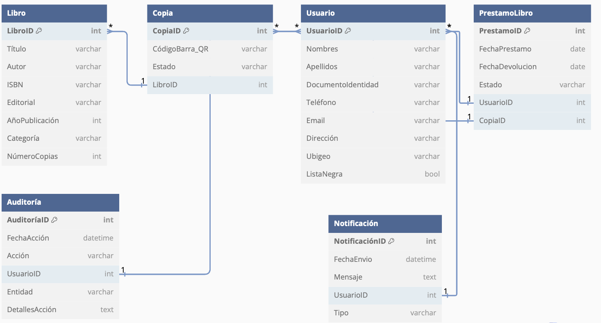
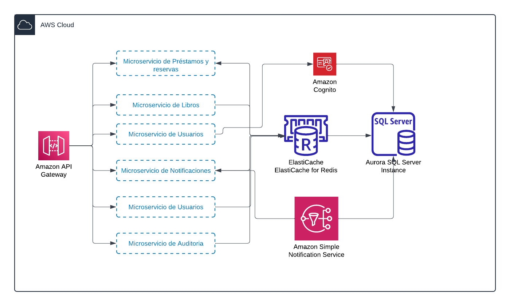

# Diagrama Entidad Relación (Solo Aplicación Biblioteca)


# Diagrama Arquitectura 


# LibreriaDB (Solo Aplicación Biblioteca)
> Libreria.sql


# API - EndPoints

## Registro de Libros
```
POST:  v1/libros/
```
## Registro de Prestamos de Libros

```
POST:  v1/libros/prestamos/
Body:  {libroId: 33,
        userId: 43}
```
